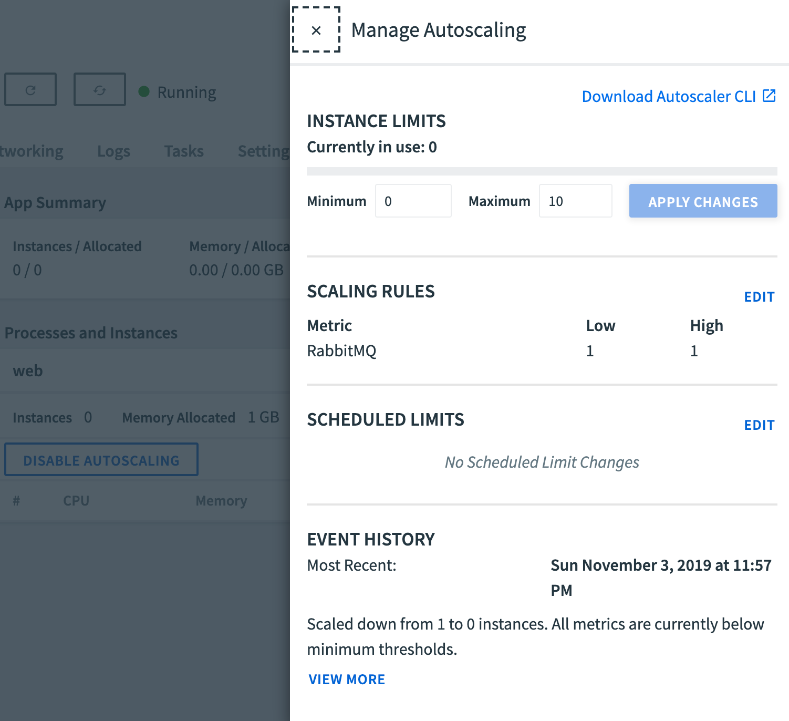
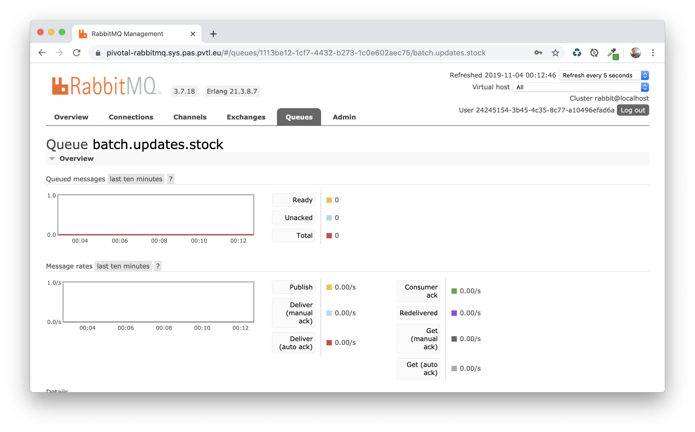
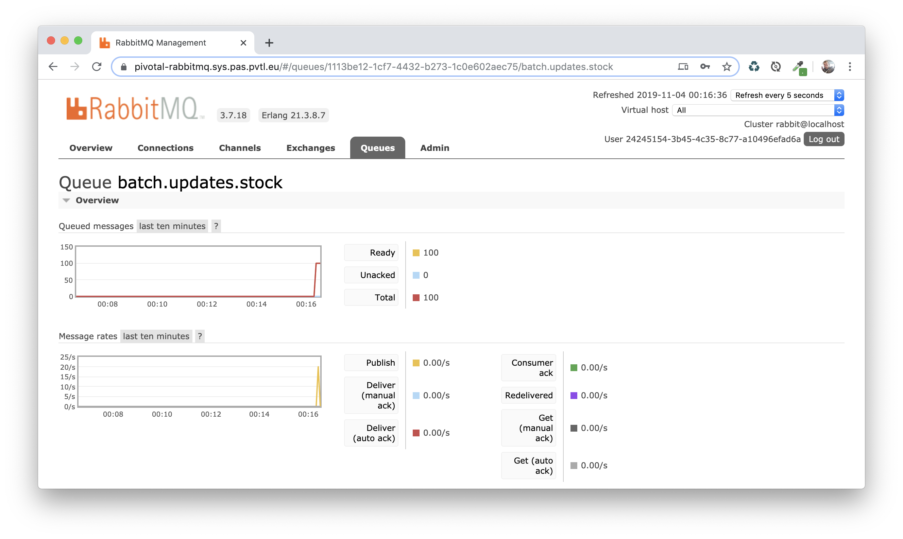
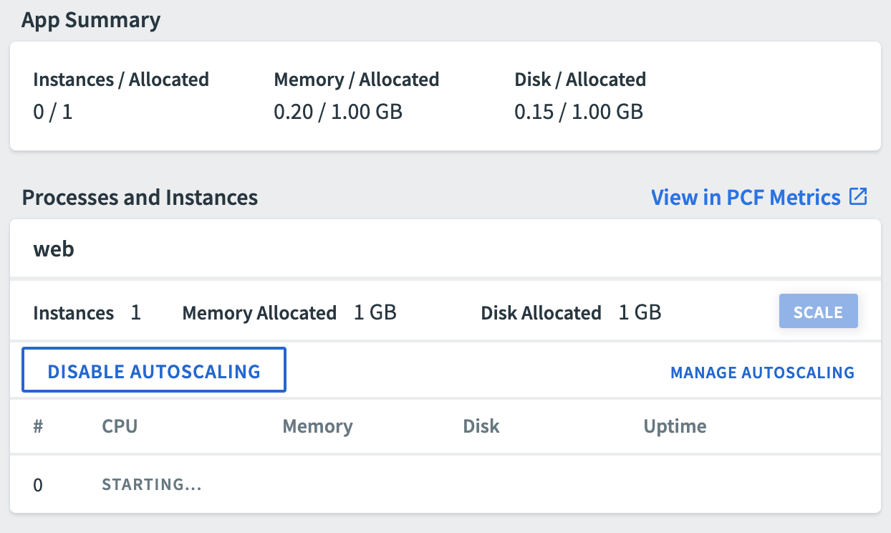

# Autoscaling batch jobs with Pivotal Platform

This project shows how to run batch jobs with autoscaling on
[Pivotal Platform](https://pivotal.io/platform).

Depending on the number of items to process, app instances will automatically be
started.
As the number of items is reduced, these instances will be stopped by the
platform. You will eventually end up with no instances running if there is no item to
process.

This demo is leveraging a RabbitMQ message broker to implement this pattern.
Batch items are pushed to a message queue, waiting to be processed by job instances.
These jobs are started by the platform to consume queue items.
The number of started instances is controlled by the
[Pivotal Autoscaler service](https://docs.pivotal.io/platform/application-service/appsman-services/autoscaler/using-autoscaler-cli.html).

## How to use it?

This demo is made of 2 components:
 - a batch job, leveraging a RabbitMQ message broker to offload batch processing;
 - an injector to generate a number of items to process.

 Compile these components using a JDK 11+:
 ```bash
 $ ./mvnw clean package
 ```

Make sure you have a RabbitMQ message broker running:
```bash
$ cf create-service p.rabbitmq single-node-3.7 rabbitmq
```

You also need to
[install the Pivotal Autoscaler CLI plugin](https://docs.pivotal.io/pivotalcf/appsman-services/autoscaler/using-autoscaler-cli.html#install).

You are now ready to deploy these apps to your Pivotal Platform installation:
```bash
$ cf push
```

Check apps are running:
```bash
$ cf apps
Getting apps in org Foo / space Bar as johndoe@pivotal.io...
OK

name                             requested state   instances   memory   disk   urls
pcf-batch-autoscaling-injector   started           1/1         1G       1G     pcf-batch-autoscaling-injector-talkative-duiker.apps.pas.pvtl.eu
pcf-batch-autoscaling-job        started           1/1         1G       1G
```

## Configuring autoscaling

Create an autoscaler service instance (unless an instance already exists in your space):
```bash
$ cf create-service app-autoscaler standard autoscaler
```

Bind this autoscaler service instance to the batch job app:
```bash
$ cf bind-service pcf-batch-autoscaling-job autoscaler
$ cf enable-autoscaling pcf-batch-autoscaling-job
```

At this point, you should be able to see all apps bound to the autoscaler service:
```bash
$ cf autoscaling-apps
Presenting autoscaler apps in org Foo / space Bar as johndoe@pivotal.io
OK
Name                        Guid                                   Enabled   Min Instances   Max Instances
pcf-batch-autoscaling-job   812018df-1b43-4377-9e32-6c50234b4b3e   true     -1              -1
```

Let's set autoscaling rules:
```bash
$ cf configure-autoscaling pcf-batch-autoscaling-job autoscaling.yml
Setting autoscaler settings for app pcf-batch-autoscaling-job in org Foo / space Bar as johndoe@pivotal.io
OK
```

Autoscaling rules are defined in `autoscaling.yml`:
```yaml
---
instance_limits:
  min: 0
  max: 10
rules:
  - rule_type: "rabbitmq"
    rule_sub_type: "batch.updates.stock"
    threshold:
      min: 1
      max: 1
scheduled_limit_changes: []
```

The `rule_sub_type` is set to the queue name used by the batch job:
the value here is `batch.updates.stock`.
A new instance will be started as long as there is at least 1 item in the queue.
In the same way instances are stopped when the queue is empty.

Up to 10 instances will be created.
When there is no item to process, all instances will be stopped.

You may also configure autoscaling rules using the UI:



## Testing autoscaling

Use the RabbitMQ Management Console to monitor queue activity.
The console is available from the RabbitMQ service instance.



You need to publish items in the `batch.updates.stock` queue.
Hit the injector URL to generate batch items (a random route was generated):
```bash
$ curl -s pcf-batch-autoscaling-injector-RANDOM.domain.com/inject?n=100
```

This command will generate 100 batch items in the queue:



As new items are written to the queue, watch new app instances being started by the Pivotal Autoscaler service:



If you keep adding more batch items in the queue, new instances
will be automatically started.
The number of instances will eventually scale down to zero when there is no more item
in the queue to process.

## Contribute

Contributions are always welcome!

Feel free to open issues & send PR.

## License

Copyright &copy; 2019 [Pivotal Software, Inc](https://pivotal.io).

This project is licensed under the [Apache Software License version 2.0](https://www.apache.org/licenses/LICENSE-2.0).
